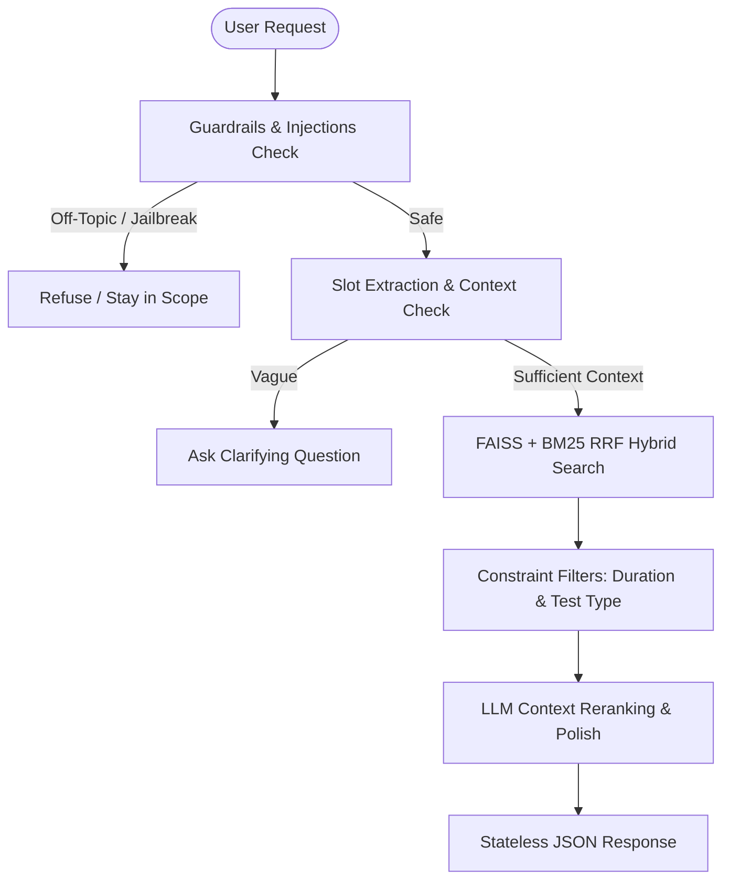

# 🧠 SHL Assessment Recommender — AI-Powered Hiring Intelligence

A production-grade conversational recommender agent built on a stateless **FastAPI** backend and a premium glassmorphic frontend. It leverages a **hybrid FAISS + BM25 retrieval engine** to recommend exact science-backed assessments from the SHL product catalog based on user hiring needs.

---

## 🚀 Quick Start

### Option A: Run with Docker Compose (Recommended)
This is the easiest way to run the entire stack (including downloading the embeddings model and building search indexes).
1. Clone the repository and navigate into it:
   ```bash
   git clone https://github.com/MoAftaab/sharp-asta.git
   cd sharp-asta
   ```
2. Create a `.env` file from the template:
   ```bash
   cp .env.example .env
   ```
   *(Optional: Populate `GEMINI_API_KEY` and `GROQ_API_KEY` in `.env` for full LLM polishing).*
3. Run the container:
   ```bash
   docker-compose up --build
   ```
4. Access the web interface at [http://localhost:8000](http://localhost:8000).

---

### Option B: Local Python Development
1. Initialize a virtual environment and install dependencies:
   ```bash
   python -m venv .venv
   .\.venv\Scripts\Activate.ps1
   pip install -r requirements.txt
   ```
2. Build the FAISS and BM25 search indexes:
   ```bash
   python scripts/build_index.py
   ```
3. Start the FastAPI development server:
   ```bash
   uvicorn app.main:app --reload
   ```
4. Open your browser to [http://127.0.0.1:8000](http://127.0.0.1:8000).

---

## 📡 API Endpoints

The API is fully stateless. The conversation history is passed in each request, and no session state is stored on the server.

### 1. Health Readiness Check
*   **Path:** `GET /health`
*   **Response:**
    ```json
    { "status": "ok" }
    ```
*   **Status Code:** `200 OK`

---

### 2. Conversational Agent Recommendation
*   **Path:** `POST /chat`
*   **Headers:** `Content-Type: application/json`
*   **Request Schema:**
    ```json
    {
      "messages": [
        {
          "role": "user",
          "content": "I am hiring a Java developer who works with stakeholders."
        }
      ]
    }
    ```
*   **Response Schema:**
    ```json
    {
      "reply": "Got it. Here are 2 assessments that fit a mid-level Java dev with stakeholder needs.",
      "recommendations": [
        {
          "name": "Core Java",
          "url": "https://www.shl.com/solutions/products/java/",
          "test_type": "K"
        },
        {
          "name": "OPQ32r",
          "url": "https://www.shl.com/solutions/products/opq/",
          "test_type": "P"
        }
      ],
      "end_of_conversation": false
    }
    ```
*   **Key Fields:**
    - `reply` (str): Conversational assistant message.
    - `recommendations` (list): A list of 1 to 10 shortlisted items (empty if gathering context or refusing).
    - `end_of_conversation` (bool): `true` if a closing intent (e.g. "thank you") was detected, closing inputs.

---

## 🛡️ Core Architecture



### 🧠 Hybrid FAISS + BM25 Retrieval
- **FAISS Semantic Search:** Vectorizes queries using `all-MiniLM-L6-v2` and runs cosine similarity against catalog items.
- **BM25 Keyword Search:** Exact keyword matches are scored to catch precise programming languages (e.g. "C++", "Java", "SQL").
- **Reciprocal Rank Fusion (RRF):** Fuses the ranks of semantic search and keyword matches for optimal recall scoring.
- **Graceful Fallback:** If indices are not built, fallbacks to rule-based token mapping immediately.

---

## ☁️ Deploing on Render

This repository is ready to deploy directly on **Render** using Docker.

1. **Create a Web Service on Render:**
   - Connect your GitHub repository.
   - Select **Docker** as the Runtime.
2. **Environment Variables:**
   Add these in your Render Dashboard:
   - `GEMINI_API_KEY`: Your Google Gemini API Key.
   - `GROQ_API_KEY`: Your Groq API Key.
   - `LLM_PROVIDER`: `auto` (detects and prioritizes active LLM API Keys).
3. **Deploy:** Render will automatically build the Dockerfile, pre-download the embedding models, build the FAISS index at build-time, and host your service.
